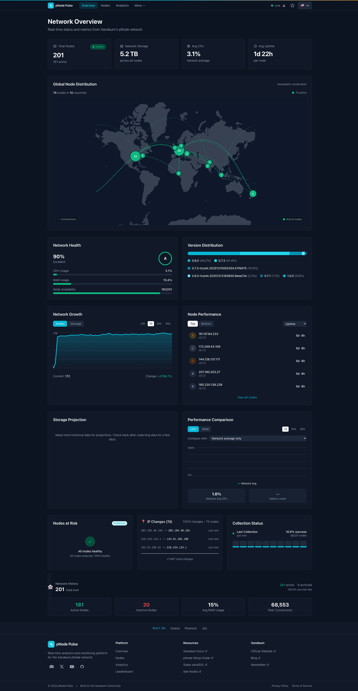

<div align="center">

# pNode Pulse

### Real-time Analytics for the Xandeum pNode Network

[](https://pulse.rectorspace.com)
[](LICENSE)
[](https://www.typescriptlang.org/)
[](https://nextjs.org/)

<br/>

**Monitor 200+ nodes across 10+ countries with real-time metrics, storage analytics, and network health insights.**

<br/>

<a href="https://pulse.rectorspace.com">
  
</a>

<br/>
<br/>

[View Live Demo](https://pulse.rectorspace.com) · [Report Bug](https://github.com/RECTOR-LABS/pnode-pulse/issues) · [Request Feature](https://github.com/RECTOR-LABS/pnode-pulse/issues)

</div>

---

## Overview

**pNode Pulse** is a comprehensive analytics platform for monitoring Xandeum's decentralized storage network. Track node performance, storage capacity, network health, and growth trends in real-time.

> Built for the [Superteam Bounty: Build Analytics Platform for Xandeum pNodes](https://earn.superteam.fun/listing/build-analytics-platform-for-xandeum-pnodes/)

---

## Features

<table>
<tr>
<td width="50%">

### 🌐 Network Overview

- **200+ nodes** tracked in real-time
- Global distribution map with **10+ countries**
- Network health score with **A-F grading**
- Version distribution analytics

</td>
<td width="50%">

### 💾 Storage Analytics

- **5+ TB** total network capacity
- Per-node storage metrics
- Capacity growth projections
- Public vs Private node classification

</td>
</tr>
<tr>
<td width="50%">

### 📊 Performance Monitoring

- CPU & RAM utilization tracking
- Uptime leaderboards
- Node comparison tools
- Historical trend analysis

</td>
<td width="50%">

### 🔔 Advanced Features

- IP change detection & logging
- Node graveyard for inactive nodes
- Predictive health alerts
- Real-time WebSocket updates

</td>
</tr>
</table>

---

## Quick Start

### Prerequisites

- Node.js 20+
- Docker & Docker Compose

### Installation

```bash
# 1. Clone and setup
git clone https://github.com/RECTOR-LABS/pnode-pulse.git
cd pnode-pulse
cp .env.example .env

# 2. Start services
docker compose up -d postgres redis
npm install
npx prisma migrate deploy

# 3. Run
npm run dev
```

Open [http://localhost:3000](http://localhost:3000) to view the dashboard.

---

## Tech Stack

<table>
<tr>
<td align="center" width="96">

<br>Next.js 14
</td>
<td align="center" width="96">

<br>TypeScript
</td>
<td align="center" width="96">

<br>Tailwind
</td>
<td align="center" width="96">

<br>PostgreSQL
</td>
<td align="center" width="96">

<br>Redis
</td>
<td align="center" width="96">

<br>Docker
</td>
</tr>
</table>

**Additional**: tRPC · TimescaleDB · Prisma · Recharts · React Query

---

## Architecture

```
┌─────────────────────────────────────────────────────────────┐
│                       pNode Pulse                           │
├─────────────────────────────────────────────────────────────┤
│  ┌─────────────┐  ┌─────────────┐  ┌─────────────────────┐ │
│  │   Next.js   │  │  Collector  │  │   TimescaleDB       │ │
│  │  Dashboard  │◄─┤   Worker    │─►│  (Time-series DB)   │ │
│  └──────┬──────┘  └──────┬──────┘  └─────────────────────┘ │
│         │                │                                  │
│         └───────────────►│◄──── Redis (Cache) ────────────► │
└─────────────────────────────────────────────────────────────┘
                           │
                           ▼
┌─────────────────────────────────────────────────────────────┐
│                    Xandeum pNode Network                    │
├─────────────────────────────────────────────────────────────┤
│     pNode 1        pNode 2        pNode 3       pNode N     │
│      :6000          :6000          :6000         :6000      │
│         └─────────── Gossip Network (:9001) ────────────┘   │
└─────────────────────────────────────────────────────────────┘
```

---

## API Reference

pNode Pulse exposes a public REST API for integration:

| Endpoint                    | Description                         |
| --------------------------- | ----------------------------------- |
| `GET /api/v1/nodes`         | List all nodes with current metrics |
| `GET /api/v1/nodes/:id`     | Get specific node details           |
| `GET /api/v1/network/stats` | Network-wide statistics             |
| `GET /api/v1/leaderboard`   | Node rankings by various metrics    |
| `GET /api/health`           | Health check endpoint               |

[View Full API Documentation →](docs/API.md)

---

## Documentation

| Document                                                                 | Description                |
| ------------------------------------------------------------------------ | -------------------------- |
| [User Guide](docs/USER_GUIDE.md)                                         | How to use each feature    |
| [Deployment Guide](docs/DEPLOYMENT.md)                                   | Self-hosting instructions  |
| [API Reference](docs/API.md)                                             | REST API documentation     |
| [pRPC Reference](https://docs.xandeum.network/xandeum-pnode-setup-guide) | Xandeum pRPC documentation |

---

## Contributing

Contributions are welcome! Please feel free to submit a Pull Request.

1. Fork the repository
2. Create your feature branch (`git checkout -b feature/amazing-feature`)
3. Commit your changes (`git commit -m 'Add amazing feature'`)
4. Push to the branch (`git push origin feature/amazing-feature`)
5. Open a Pull Request

---

## License

This project is licensed under the MIT License - see the [LICENSE](LICENSE) file for details.

---

## Acknowledgments

- [Xandeum Network](https://xandeum.network) - The decentralized storage network
- [Superteam](https://superteam.fun) - For hosting the bounty
- [Solana](https://solana.com) - The underlying blockchain

---

<div align="center">

**[Website](https://pulse.rectorspace.com)** · **[Xandeum](https://xandeum.network)** · **[Discord](https://discord.com/invite/mGAxAuwnR9)** · **[GitHub](https://github.com/RECTOR-LABS/pnode-pulse)**

<br/>

Built with ❤️ for the Xandeum ecosystem

</div>
